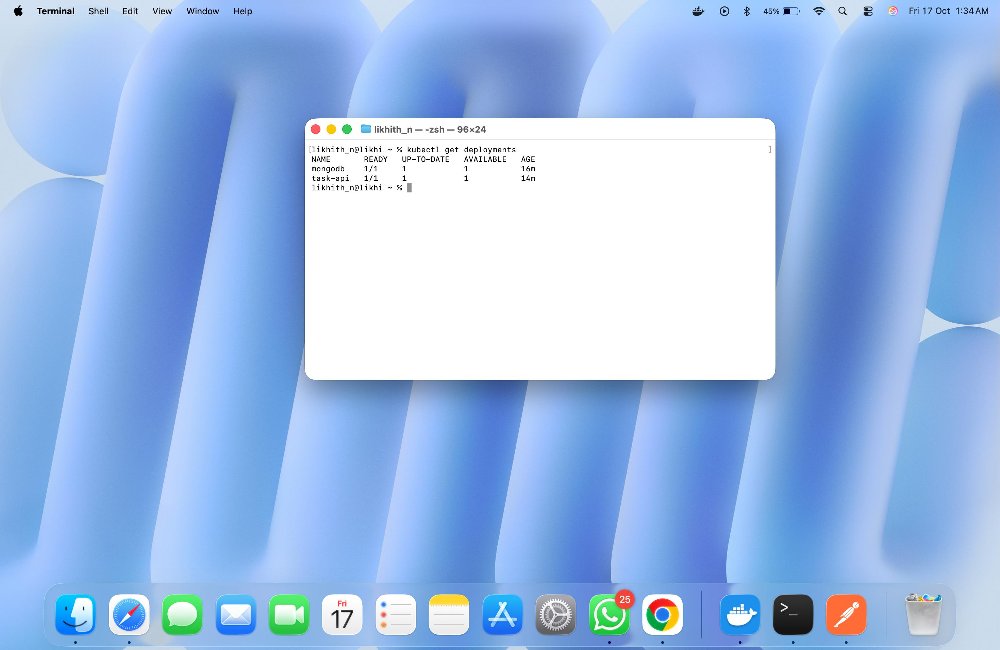
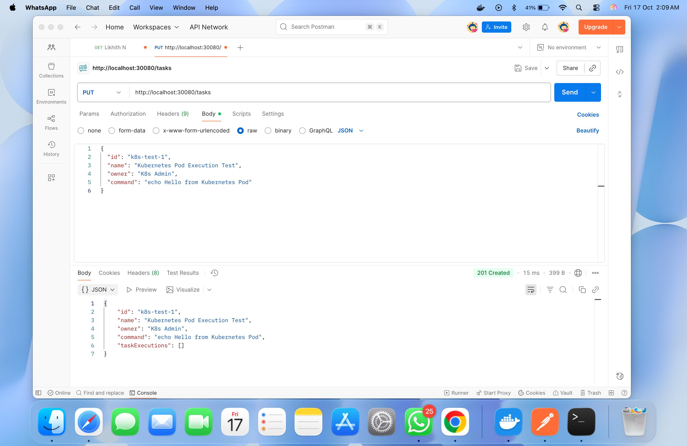

Task Execution Manager - Kubernetes Deployment (Task 2)

# Table of Contents:

        Overview
        Architecture(Image)
        Key Features
        Prerequisites
        Project Structure
        Setup & Deployment
        Kubernetes Resources
        Testing & Verification
        API Testing with Postman
        Learning Outcomes

---

# Overview:
    This is an enhanced version of the Task Execution Manager that deploys to Kubernetes. The application now executes shell commands in separate Kubernetes pods (using busybox image) instead of running them locally. This provides better isolation, scalability, and security.

---

# Architecture:

---

# Key Features:

    Container & Orchestration:
            Docker Multi-Stage Build - Optimized image size with separate build and runtime stages
            Kubernetes Native - Designed to run in Kubernetes from the ground up
            Auto-Scaling Ready - Can be scaled horizontally by adjusting replicas
            Health Checks - Liveness and readiness probes for automatic recovery

    Execution Model:
            Isolated Execution - Each task runs in its own Kubernetes pod
            Busybox Container - Lightweight container for command execution
            Automatic Cleanup - Execution pods are automatically deleted after completion
            Execution History - All pod executions are tracked and stored

    Storage & Persistence:
            Persistent Volume - MongoDB data survives pod restarts
            Volume Claims - Declarative storage management
            Data Safety - Database records persist even when MongoDB pod is deleted

    Security:
            RBAC (Role-Based Access Control) - Dedicated ServiceAccount with minimal permissions
            Pod Creation Rights - Application can only create pods (no cluster-wide access)
            Command Validation - Same security checks as Task 1
            Namespace Isolation - All resources in dedicated namespace

    Configuration:
            Environment Variables - MongoDB connection and namespace configuration
            External Configuration - Easy to change without rebuilding
            12-Factor App - Follows cloud-native best practices

---

# Prerequisites:

    Required Software:
        # Docker Desktop (includes Kubernetes)
        # Download from: https://www.docker.com/products/docker-desktop 

    System Requirements:
        macOS 11+ (Big Sur or later)
        8GB RAM minimum (16GB recommended)
        20GB free disk space
        Docker Desktop with Kubernetes enabled

---

# Project Structure:

    task-api/
├── Dockerfile                          
├── .dockerignore                      
├── pom.xml                           
├── k8s/                             
│   ├── mongodb-pv.yaml               
│   ├── mongodb-pvc.yaml               
│   ├── mongodb-deployment.yaml       
│   ├── mongodb-service.yaml          
│   ├── app-serviceaccount.yaml        
│   ├── app-deployment.yaml            
│   └── app-service.yaml               
├── src/
│   └── main/
│       ├── java/com/kaiburr/taskapi/
│       │   ├── TaskApiApplication.java
│       │   ├── controller/
│       │   │   └── TaskController.java
│       │   ├── service/
│       │   │   └── TaskService.java   
│       │   ├── repository/
│       │   │   └── TaskRepository.java
│       │   ├── model/
│       │   │   ├── Task.java
│       │   │   └── TaskExecution.java
│       │   └── util/
│       │       └── CommandValidator.java
│       └── resources/
│           └── application.properties  
└── Test_Snapshots/                      
|
└── Support_Snapshots

---
# Phase 1:
Setup & Deployment:
        #Enable Kubernetes in Docker Desktop:
        # Settings → Kubernetes → Enable Kubernetes 

Verify it's working:
        kubectl version --client
        kubectl cluster-info
        kubectl get nodes

Expected output:
        NAME             STATUS   ROLES           AGE   VERSION
        docker-desktop   Ready    control-plane   5m    v1.27.x

---
## Phase 2 and 3 Already done (Only for proof purpose)
# Phase 2: Create Docker Files (2 new files)

File 1: Create Dockerfile (In terminal Enter below command)
        cd task-api
        nano Dockerfile

Copy and Paste the below content in Dockerfile

Content:
***

        # Use Maven image to build the application
        FROM maven:3.8.6-openjdk-11-slim AS build

        # Set working directory
        WORKDIR /app

        # Copy pom.xml and download dependencies
        COPY pom.xml .
        RUN mvn dependency:go-offline -B

        # Copy source code
        COPY src ./src

        # Build the application
        RUN mvn clean package -DskipTests

        # Use OpenJDK for runtime
        FROM openjdk:11-jre-slim

        # Set working directory
        WORKDIR /app

        # Copy the jar file from build stage
        COPY --from=build /app/target/*.jar app.jar

        # Expose port 8080
        EXPOSE 8080

        # Run the application
        ENTRYPOINT ["java", "-jar", "app.jar"]

***

Save: Ctrl+O, Enter, Ctrl+X

File 2: Create .dockerignore (In terminal Enter below command)
        nano .dockerignore

Copy and Paste the below content in .dockerignore

Content:
***

        target/
        !target/*.jar
        .mvn/
        mvnw
        mvnw.cmd
        .git
        .gitignore
        README.md
        Test_Snapshots/
        *.md
        .DS_Store

***

Save: Ctrl+O, Enter, Ctrl+X

---
Phase 3: Create Kubernetes Directory and YAML Files (7 files)

Create k8s directory: (Enter this in terminal)
        mkdir k8s
        cd k8s

        File 1: mongodb-pv.yaml
                nano mongodb-pv.yaml (in terminal)
                #Copy and Paste the below content
                ***
                        apiVersion: v1
                        kind: PersistentVolume
                        metadata:
                        name: mongodb-pv
                        labels:
                        app: mongodb
                        spec:
                        capacity:
                        storage: 1Gi
                        accessModes:
                        - ReadWriteOnce
                        persistentVolumeReclaimPolicy: Retain
                        storageClassName: manual
                        hostPath:
                        path: /data/mongodb
                        type: DirectoryOrCreate
                ***
Save: Ctrl+O, Enter, Ctrl+X

        File 2: mongodb-pvc.yaml
                nano mongodb-pvc.yaml (in terminal)
                #Copy and Paste the below content
                ***
                        apiVersion: v1
                        kind: PersistentVolumeClaim
                        metadata:
                        name: mongodb-pvc
                        labels:
                        app: mongodb
                        spec:
                        accessModes:
                        - ReadWriteOnce
                        storageClassName: manual
                        resources:
                        requests:
                        storage: 1Gi
                ***
Save: Ctrl+O, Enter, Ctrl+X

        File 3: mongodb-deployment.yaml
                nano mongodb-pv.yaml (in terminal)
                #Copy and Paste the below content
                ***
                        apiVersion: apps/v1
                        kind: Deployment
                        metadata:
                        name: mongodb
                        labels:
                        app: mongodb
                        spec:
                        replicas: 1
                        selector:
                        matchLabels:
                        app: mongodb
                        template:
                        metadata:
                        labels:
                                app: mongodb
                        spec:
                        containers:
                        - name: mongodb
                                image: mongo:7.0
                                ports:
                                - containerPort: 27017
                                name: mongodb
                                env:
                                - name: MONGO_INITDB_DATABASE
                                value: "taskdb"
                                volumeMounts:
                                - name: mongodb-storage
                                mountPath: /data/db
                                resources:
                                requests:
                                memory: "256Mi"
                                cpu: "250m"
                                limits:
                                memory: "512Mi"
                                cpu: "500m"
                        volumes:
                        - name: mongodb-storage
                                persistentVolumeClaim:
                                claimName: mongodb-pvc
                ***
Save: Ctrl+O, Enter, Ctrl+X

        File 4: mongodb-service.yaml
                nano mongodb-service.yaml (in terminal)
                #Copy and Paste the below content
                ***
                        apiVersion: v1
                        kind: Service
                        metadata:
                        name: mongodb
                        labels:
                        app: mongodb
                        spec:
                        type: ClusterIP
                        ports:
                        - port: 27017
                        targetPort: 27017
                        protocol: TCP
                        name: mongodb
                        selector:
                        app: mongodb
                ***
Save: Ctrl+O, Enter, Ctrl+X

        File 5: app-serviceaccount.yaml
                nano app-serviceaccount.yaml (in terminal)
                #Copy and Paste the below content
                ***
                        apiVersion: v1
                        kind: ServiceAccount
                        metadata:
                        name: task-api-sa
                        namespace: default
                        ---
                        apiVersion: rbac.authorization.k8s.io/v1
                        kind: Role
                        metadata:
                        name: task-api-role
                        namespace: default
                        rules:
                        - apiGroups: [""]
                        resources: ["pods", "pods/log"]
                        verbs: ["create", "get", "list", "delete", "watch"]
                        - apiGroups: [""]
                        resources: ["pods/exec"]
                        verbs: ["create"]
                        ---
                        apiVersion: rbac.authorization.k8s.io/v1
                        kind: RoleBinding
                        metadata:
                        name: task-api-rolebinding
                        namespace: default
                        subjects:
                        - kind: ServiceAccount
                        name: task-api-sa
                        namespace: default
                        roleRef:
                        kind: Role
                        name: task-api-role
                        apiGroup: rbac.authorization.k8s.io
                ***
Save: Ctrl+O, Enter, Ctrl+X

        File 6: app-deployment.yaml
                nano app-deployment.yaml (in terminal)
                #Copy and Paste the below content
                ***
                        apiVersion: apps/v1
                        kind: Deployment
                        metadata:
                        name: task-api
                        labels:
                        app: task-api
                        spec:
                        replicas: 1
                        selector:
                        matchLabels:
                        app: task-api
                        template:
                        metadata:
                        labels:
                                app: task-api
                        spec:
                        serviceAccountName: task-api-sa
                        containers:
                        - name: task-api
                                image: task-api:latest
                                imagePullPolicy: Never
                                ports:
                                - containerPort: 8080
                                name: http
                                env:
                                - name: MONGODB_HOST
                                value: "mongodb"
                                - name: MONGODB_PORT
                                value: "27017"
                                - name: MONGODB_DATABASE
                                value: "taskdb"
                                - name: KUBERNETES_NAMESPACE
                                value: "default"
                                resources:
                                requests:
                                memory: "512Mi"
                                cpu: "250m"
                                limits:
                                memory: "1Gi"
                                cpu: "500m"
                                livenessProbe:
                                httpGet:
                                path: /tasks
                                port: 8080
                                initialDelaySeconds: 30
                                periodSeconds: 10
                                readinessProbe:
                                httpGet:
                                path: /tasks
                                port: 8080
                                initialDelaySeconds: 20
                                periodSeconds: 5
                ***
Save: Ctrl+O, Enter, Ctrl+X

        File 7: app-service.yaml
                nano app-service.yaml (in terminal)
                #Copy and Paste the below content
                ***
                        apiVersion: v1
                        kind: Service
                        metadata:
                        name: task-api
                        labels:
                        app: task-api
                        spec:
                        type: NodePort
                        ports:
                        - port: 8080
                        targetPort: 8080
                        nodePort: 30080
                        protocol: TCP
                        name: http
                        selector:
                        app: task-api
                ***
Save: Ctrl+O, Enter, Ctrl+X

##

---
# Phase 4: Build Docker Image

#Make sure you're in task-api directory
cd task-api

#Build the Docker image (this will take 3-5 minutes first time)
docker build -t task-api:latest .

#Building

#Build Success

#Verify image exists:
        In terminal:
                docker images | grep task-api

        Expected:
                task-api    latest    abc123def456    2 minutes ago    300MB

---
# Phase 5:
Deploy to Kubernetes:
        Deploy MongoDB First:
                kubectl apply -f k8s/mongodb-pv.yaml
                kubectl apply -f k8s/mongodb-pvc.yaml
                kubectl apply -f k8s/mongodb-deployment.yaml
                kubectl apply -f k8s/mongodb-service.yaml

        Check MongoDB is running:
                kubectl get pods -l app=mongodb

        Deploy Application:
                kubectl apply -f k8s/app-serviceaccount.yaml
                kubectl apply -f k8s/app-deployment.yaml
                kubectl apply -f k8s/app-service.yaml

        Check application is running:
                kubectl get pods -l app=task-api

---
# Phase 6: Verify Deployment
        #View all pods
        kubectl get pods

        #View all services
        kubectl get services

        #View deployments
        kubectl get deployments

        #View persistent volumes
        kubectl get pv,pvc

# Phase 7: Test the Application

PART 1: Kubectl Terminal Screenshots (8 Required)

# Test 1: Show All Pods Running:
                bashkubectl get pods
                Expected Output:
                NAME                        READY   STATUS    RESTARTS   AGE
                mongodb-xxxxxxxxxx-xxxxx    1/1     Running   0          5m
                task-api-xxxxxxxxx-xxxxx    1/1     Running   0          4m

# Test 2: Show Services with NodePort
bashkubectl get services

Expected Output:
        NAME         TYPE        CLUSTER-IP      EXTERNAL-IP   PORT(S)          AGE
        kubernetes   ClusterIP   10.96.0.1       <none>        443/TCP          10m
        mongodb      ClusterIP   10.96.xxx.xxx   <none>        27017/TCP        5m
        task-api     NodePort    10.96.xxx.xxx   <none>        8080:30080/TCP   4m

# Test 3: Show Deployments
bashkubectl get deployments

Expected Output:
        NAME       READY   UP-TO-DATE   AVAILABLE   AGE
        mongodb    1/1     1            1           5m
        task-api   1/1     1            1           4m

# Test 4: Show Persistent Volume and PVC
bashkubectl get pv,pvc

Expected Output:
        NAME                          CAPACITY   ACCESS MODES   RECLAIM POLICY   STATUS   CLAIM
        persistentvolume/mongodb-pv   1Gi        RWO            Retain           Bound    default/mongodb-pvc

        NAME                                STATUS   VOLUME       CAPACITY   ACCESS MODES
        persistentvolumeclaim/mongodb-pvc   Bound    mongodb-pv   1Gi        RWO

# Test 5: Show MongoDB Pod with Persistent Volume Mounted
bashkubectl describe pod -l app=mongodb | grep -A 10 "Volumes:"

Expected Output:
        Volumes:
                mongodb-storage:
                Type:       PersistentVolumeClaim (a reference to a PersistentVolumeClaim in the same namespace)
                ClaimName:  mongodb-pvc
                ReadOnly:   false
                Mounts:
                /data/db from mongodb-storage (rw)

# Test 6: Show Task-API Pod Environment Variables
bashkubectl describe pod -l app=task-api | grep -A 10 "Environment:"

        Expected Output:
                Environment:
                MONGODB_HOST:         mongodb
                MONGODB_PORT:         27017
                MONGODB_DATABASE:     taskdb
                KUBERNETES_NAMESPACE: default

# Test 7: Show RBAC Resources
bashkubectl get serviceaccount,role,rolebinding

Expected Output:
        NAME                         SECRETS   AGE
        serviceaccount/default       1         10m
        serviceaccount/task-api-sa   1         5m

        NAME                                        CREATED AT
        role.rbac.authorization.k8s.io/task-api-role   2025-10-16T...

        NAME                                               ROLE                 AGE
        rolebinding.rbac.authorization.k8s.io/task-api-rolebinding   Role/task-api-role   5m

# Test 8: Show Application Logs (Kubernetes Client Initialized)
bashkubectl logs -l app=task-api --tail=30

# 

PART 2: Postman API Testing Screenshots (5 Required)

Postman Setup
Base URL: http://localhost:30080

# Test 9: GET /tasks - Verify Endpoint is Accessible
Request:
        Method: GET
        URL: http://localhost:30080/tasks
        Expected Response:
        json[]
        Status: 200 OK

# Test 10: PUT /tasks - Create Kubernetes Test Task
Request:
        Method: PUT
        URL: http://localhost:30080/tasks
        Headers: Content-Type: application/json
        Body (raw JSON):
        json{
        "id": "k8s-test-1",
        "name": "Kubernetes Pod Execution Test",
        "owner": "K8s Admin",
        "command": "echo Hello from Kubernetes Pod && date && hostname"
        }
        Expected Response:
        json{
        "id": "k8s-test-1",
        "name": "Kubernetes Pod Execution Test",
        "owner": "K8s Admin",
        "command": "echo Hello from Kubernetes Pod && date && hostname",
        "taskExecutions": []
        }
        Status: 201 Created

# Test 11: PUT /tasks/{id}/execute - Execute in Kubernetes Pod
Request:
        Method: PUT
        URL: http://localhost:30080/tasks/k8s-test-1/execute
        No body needed
        Expected Response:
        json{
        "startTime": "2025-10-16T19:45:23.456Z",
        "endTime": "2025-10-16T19:45:25.789Z",
        "output": "Hello from Kubernetes Pod\nWed Oct 16 19:45:24 UTC 2025\ntask-exec-k8s-test-1-abc12345\n"
        }
        Status: 200 OK

# Test 12: GET /tasks?id=k8s-test-1 - View Execution History
Request:
        Method: GET
        URL: http://localhost:30080/tasks?id=k8s-test-1
        Expected Response:
        json{
        "id": "k8s-test-1",
        "name": "Kubernetes Pod Execution Test",
        "owner": "K8s Admin",
        "command": "echo Hello from Kubernetes Pod && date && hostname",
        "taskExecutions": [
        {
        "startTime": "2025-10-16T19:45:23.456Z",
        "endTime": "2025-10-16T19:45:25.789Z",
        "output": "Hello from Kubernetes Pod\nWed Oct 16 19:45:24 UTC 2025\ntask-exec-k8s-test-1-abc12345\n"
        }
        ]
        }
        Status: 200 OK

# Test 13: Terminal - Show Execution Pod (Run Immediately After Execution)
After you click "Send" on Screenshot 11, quickly run this in terminal:
bashkubectl get pods
Expected Output:
NAME                         READY   STATUS      RESTARTS   AGE
mongodb-xxxxxxxxxx-xxxxx     1/1     Running     0          10m
task-api-xxxxxxxxx-xxxxx     1/1     Running     0          9m

# Test 14: Execute Multiple Times
Execute the same task 2-3 more times:
bash# In Postman, execute the task again:
PUT http://localhost:30080/tasks/k8s-test-1/execute
Then get the task to show multiple executions:
bash# In Postman:
GET http://localhost:30080/tasks?id=k8s-test-1

# Test 15: Test Data Persistence (MongoDB)
Step 1: Create a task and execute it
Step 2: Delete MongoDB pod in terminal:
bashkubectl delete pod -l app=mongodb
Step 3: Wait for new MongoDB pod to start:
bashkubectl wait --for=condition=ready pod -l app=mongodb --timeout=120s
Step 4: In Postman, get the task again:
bashGET http://localhost:30080/tasks?id=k8s-test-1
Expected: Task data still exists with all execution history!

# Learning Outcomes:
        Containerizing Java Spring Boot applications with Docker
        Creating Kubernetes manifests for deployments, services, and storage
        Implementing persistent storage with PV and PVC
        Using environment variables for external configuration
        Setting up RBAC for fine-grained permissions
        Using Kubernetes API from within a pod
        Creating and managing temporary pods programmatically
        Implementing health checks with liveness and readiness probes
        Deploying multi-container applications to Kubernetes
        Testing and debugging Kubernetes deployments

# Built using Java, Spring Boot, Docker, and Kubernetes